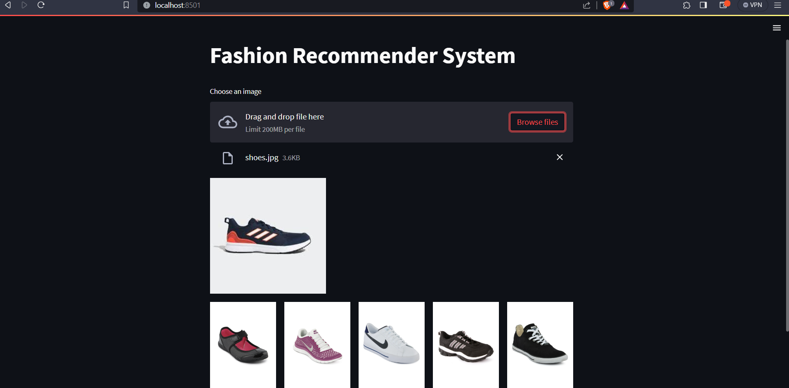

# Fashion Recommender System

#### The recommendation system uses ResNet-50.

#### To run this app you need to have tensorflow, streamlit.

#### Commands to run

- Create virtual environment
    ```
    python3 -m venv recommender
    ```

- Activate venv
    ```
    source recommender/bin/activate
    ```

- Install requirements
    ```
    pip install -r requirements.txt
    ```

- Launch project:
    ```
    streamlit run app.py
    ```
#### The dataset for the application is <a href="https://www.kaggle.com/datasets/paramaggarwal/fashion-product-images-dataset">here</a>

#### GUI of the application is as follows:


